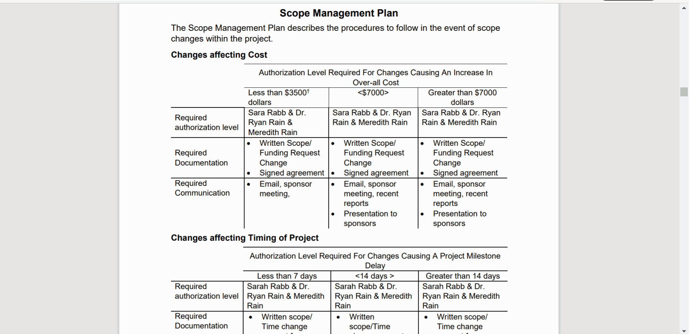

# Project-Mgmt-Final-Deliverable
An influeneza tracking form plan &amp; proposal covering everything from risk register, stakeholder management, and gantt chart and more.

This Project Managment Plan-Emergent Infectious Influenza Tracking Form pdf was the final package my group and I created detailing a proposal for a Telus PSS project to be deployed over Summer into early 2021. My main repsonsibilites within that project was creating the Business Case, Stakeholder register, sections of the communication plan, gantt chart for the project, and compiling the all documents together into a single final deliverable. 

